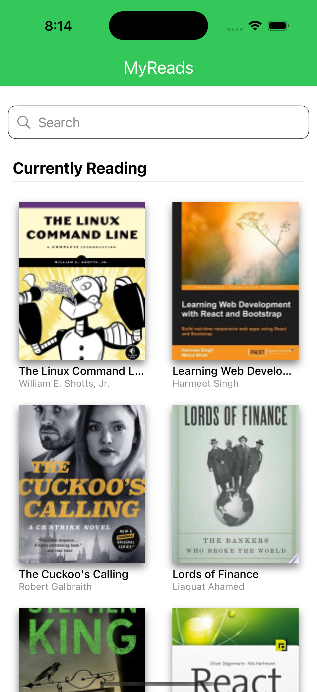
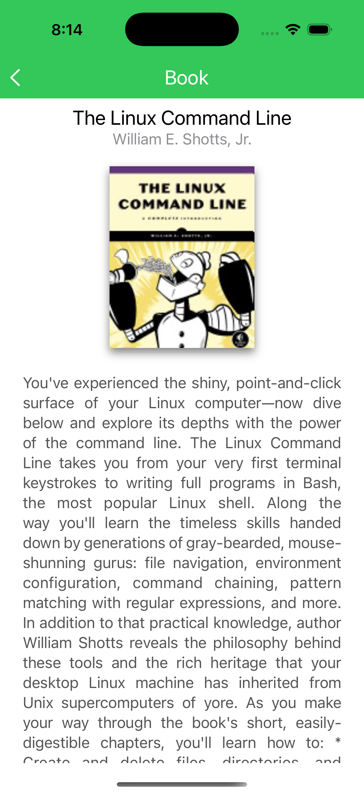

# MyReads (English)

`MyReads` is a sample project built with SwiftUI that implements the **MVVM** (Model-View-ViewModel) pattern to demonstrate how to structure an application using **best practices** and a **layered architecture**. This project is designed to be modular, scalable, and maintainable by adhering to the principles of separation of concerns.

## Project Description

The primary objective of this project is to illustrate a practical approach to organizing a Swift application using a layered architecture. It separates responsibilities into well-defined layers to ensure maintainability and readability.

This project simulates a book application where users can browse through various screens, such as a book list, search, and book details.

## Features

- **MVVM Architecture**:
  - **Core**: Contains global configurations like app routing, theme management, and shared utilities.
  - **Repositories**: Manages API calls and external integrations, encapsulating the data-fetching logic.
  - **Model**: Defines the data structures and entities used throughout the app.
  - **ViewModel**: Handles the business logic and prepares data for the views.
  - **Views**: Defines the user interface for specific pages, such as the home screen and book detail screen.
  - **Components**: Reusable UI components for building modular layouts.

## Screenshots

| **Home** | **Book Detail** |
|:-----------------------:|:-----------------------:|
|  |  |
